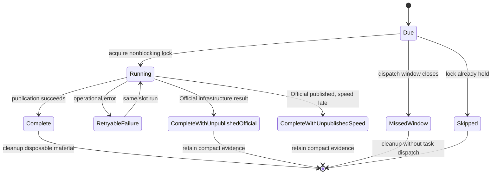
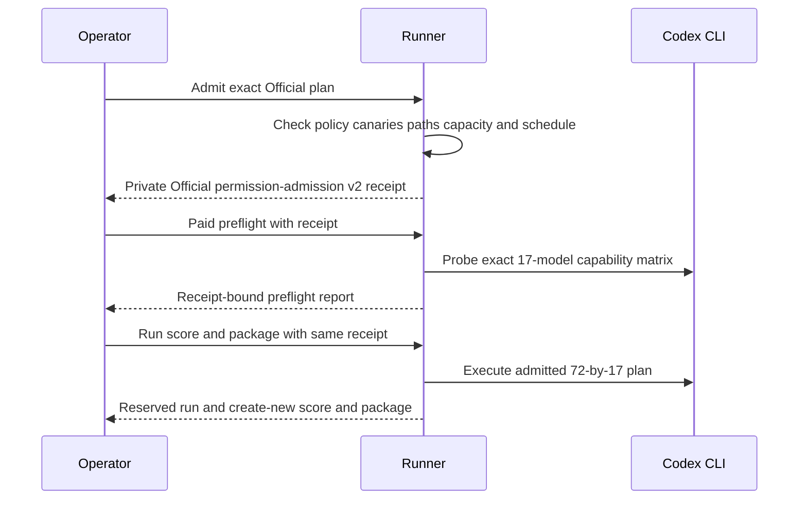
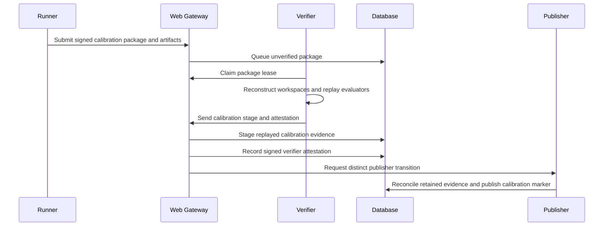
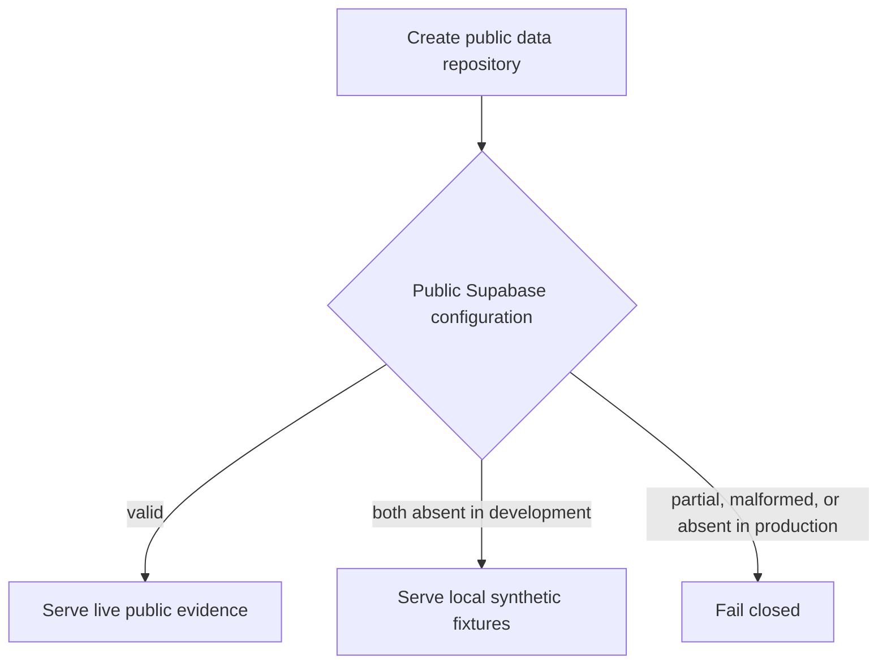
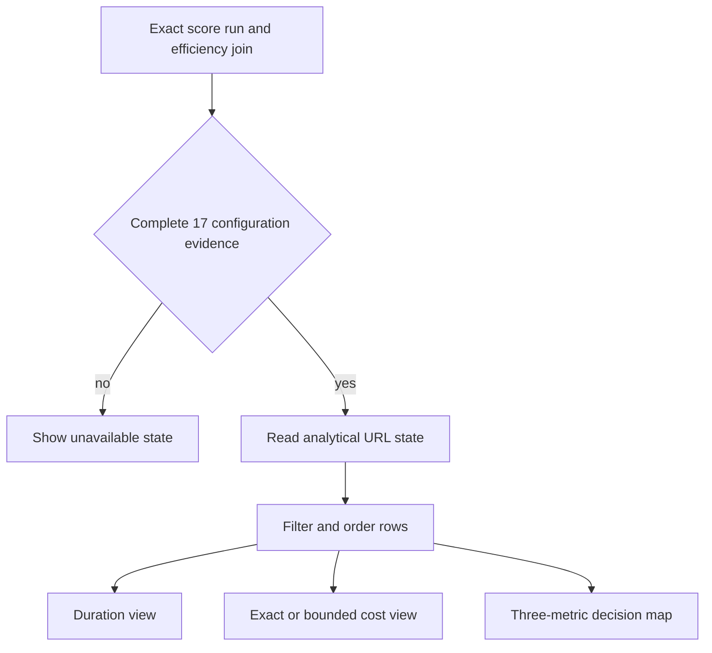
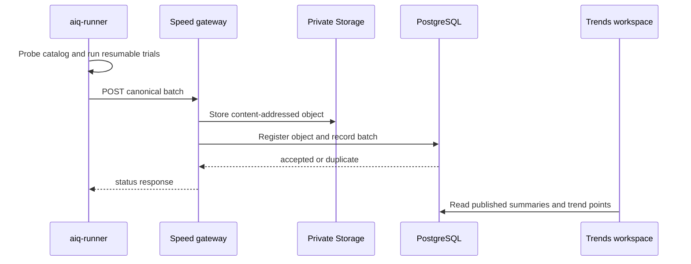

# Architecture and Runtime

## Components

| Component           | Responsibility                                                         |
| ------------------- | ---------------------------------------------------------------------- |
| `apps/aiq`          | Installed CLI for scheduled observation orchestration, release validation, and cleanup |
| `apps/aiq-runner`   | Preflight, task execution, scoring, packaging, and submission          |
| `apps/aiq-verifier` | Queue claims, reconstruction, evaluator replay, and attestations       |
| `apps/web`          | Public reads and controlled submission, claim, and verification routes |
| `databases`         | Desired PostgreSQL state, RLS, RPCs, views, and Storage metadata       |
| `benchmarks`        | Public catalog, schemas, and synthetic examples                        |

The operator supplies the private corpus, evaluator files, workspaces, runtime,
Codex profile, and keys. These inputs are not repository data.

Repository source has one active public contract: AIQ Core `1.0.7`, task scorer
`1.0.6`, aggregate scorer `1.0.8`, and measurement `2.0.0`, with task-metadata digest
`sha256:84f1d1a271e112c70f59bf7a2637f3b905b1a85d1ebee34172c63b922c9733d1`,
release-policy identity `aiq-core/1.0.7`, and public release digest
`sha256:2e9f2efec15a66a67ce0cf236aaf3d0f5403e03e7de6063ffaf3c28f0eb07aae`.
Every formal task has null wall-time, step, and tool-call limits. The runner
records elapsed time, steps, tool calls, tokens, and estimated cost without
using them in semantic scoring, AIQ, intervals, eligibility, or ranking. Prompt,
evaluator, semantic scoring, and tool permissions are unchanged. The current
method is canonicalized in [Benchmark Method](benchmark-method.md).
The public catalog is deterministic and identity-frozen. Fresh Core and
Contrast A/B seals and both model-free validators are required before
calibration. The
shared Rust validator fails closed
unless the runner subtree remains `identity_kind: source_only` with a null
`built_binary_sha256`. The checked Core schema enforces the same rule. Contrast
has equivalent shared typed enforcement even though it has no separate
checked-in JSON schema. Each corpus also binds the Node.js and ripgrep
identities. The source-only corpus rule and signed per-run runner and complete
Codex runtime provenance are the executable product contracts. The
repository-owned `seal-corpus` command creates a complete new Core or Contrast
seal from actual retained assets. It derives source-only runner,
workspace-manifest baseline, controlled-tree fixture and acceptance,
leakage-review, evaluator, runtime, toolchain, and authoring-harness identities.
It is not a task generator and cannot patch a predecessor commitment. One
create-new private directory becomes visible only after production-validator and
baseline round-trip checks pass. After the final
clean build, the operator retains a private, unsigned audit receipt with the
exact source commit and tree identity and SHA-256 values for the native runner,
verifier, Codex executable, and Codex code-mode host. The offline native
verifier validates the receipt against an independently supplied digest. It
does not publish this reproducibility evidence. Node.js and ripgrep identities
remain bound by the corpus. Policy-v2 replay of the retained complete
calibration, fixed-bank admission v3, native build verification, separate real
Official execution, publication, and final deployment of `1.0.7` are pending.
Earlier bounded runs remain immutable failed release evidence. Real calibration
can enter the public calibration register only after signed verifier admission
and distinct publication, and it remains non-Official after acceptance.
The accepted production package must be non-synthetic. Its 1,224 task-level
results are one 17-by-72 matrix, not 1,224 separate benchmark runs. The native
verifier must replay the committed evaluators before the distinct publisher can
complete publication. Production exposes only the AIQ Core `1.0.7`, task scorer
`1.0.6`, aggregate scorer `1.0.8`, and measurement `2.0.0` matrix as
`trusted_verified`. No legacy matrix is a
fallback. The outcome and efficiency semantics are detailed in [Benchmark
Method](benchmark-method.md).

## Identity boundary

Production uses three Ed25519 identities:

1. The runner signs `aiq.result-package.v4`.
2. The verifier signs `aiq.verifier-attestation.v4` and must differ from the
   runner.
3. The publisher completes the database publication transition and must differ
   from both.

The gateway mints short-lived custom-role JWTs for verifier and publisher RPCs.
The browser never receives those credentials.

## Native macOS runtime

The current production runtime runs the release builds of `aiq-runner` and
`aiq-verifier` directly on one controlled Apple Silicon macOS host. The runner
receives the private corpus, fresh workspaces, a separate immutable Codex
authentication copy, and only the runner credential needed by the active
command. The verifier receives the committed corpus, evaluator assets,
submitted artifacts, and only its verifier credential. It never receives the
Codex authentication copy.

The runner copies `~/.codex/auth.json` into a mode-private, isolated release
home and injects that directory as the Codex subprocess `CODEX_HOME`. It does
not use the interactive Codex home as its writable execution home.

The native runtime uses canonical non-overlapping paths, exact executable
digests, mode-private writable roots, create-new outputs, and macOS atomic file
operations. The installed `aiq` orchestrator validates one self-contained
release. That release contains the pinned worker binaries and an exact Git
source bundle. For each slot, `aiq` reconstructs a clean detached checkout at a
stable path below the private `state_root/scratch` directory. The path is outside
the macOS platform-minimal roots that the Codex sandbox can read. It does not
depend on a repository worktree.
Before paid preflight and paid run dispatch, the operator runs the model-free
`aiq doctor` check. Codex uses the host's direct network connection. Production
does not depend on or run Linux or Docker. They remain future deployment
targets. The native macOS host runs `aiq` for the `03:00` and `15:00` UTC slots.
The orchestrator owns the non-overlap lock, per-slot resume state, isolated Codex
homes, verified publication sequence, unattended credential delivery, and
terminal cleanup. `launchd` invokes the pinned `aiq run --config ...` command
directly with absolute paths and no repository working directory. The AIQ state
lock coalesces overlap before provider access. When all four consumer variables
are absent, AIQ reads the exact Keychain bootstrap, performs one Universal Auth
login in a private provider session, and retrieves only the four fixed
`prod:/aiq` keys. It destroys the provider session before it starts a worker.
Complete explicit four-variable delivery remains supported; partial delivery
fails closed. Canonical slot selection decides which model work is due.

Within a due slot, the orchestrator starts or resumes Official work before the
auxiliary Speed path. This preserves the P0 publication window while retaining
one user-facing `aiq run` command.

Every worker step runs below the same pinned `aiq` binary in its private internal
supervisor mode. The supervisor becomes a new process-session leader, starts the
runner or verifier in its own process group, and keeps runner-created model and
evaluator process groups inside that session. A private stdin pipe binds the
supervisor to the user-facing `aiq` parent. Parent exit, including `SIGKILL`,
closes the pipe. The supervisor then enumerates the session and applies bounded
two-second `SIGTERM` and `SIGKILL` phases before it exits. It also performs this
cleanup when it receives `SIGHUP`, `SIGINT`, or `SIGTERM`, or when a worker exits
with a live descendant. This boundary does not rely on the launchd job PGID.

The installed `apps/aiq` binary is the scheduler boundary. `cli::Cli` exposes
`run`, `status`, `doctor`, and `install-release`; `config::Configuration` accepts
only the v2 private configuration and validates absolute paths, the public HTTPS
endpoint, an HTTPS or loopback Infisical origin, exact selectors, bounded
concurrency, and the pinned release manifest digest. `release::Release::open`
checks the self-contained release before any model work, while
`Release::prepare_source` clones the bundled Git source and verifies its detached
commit, tree, and clean status at a private per-slot scratch path below
`state_root`. The scheduled process therefore does not read a repository
worktree or mutable worker paths. The hidden `operator provision-unattended`
command is a separate create-only bootstrap boundary: `provision::provision`
creates the fixed provider identity and Keychain handoff, while
`credentials` retrieves only the four declared consumer keys for the owning
steps. Runtime configuration carries selectors and paths, not secret values.
The existing production identity and Keychain account are frozen external
state; the operator command is only for a new absent target and is not a
reconciliation or rotation command.

This lifecycle shows how one canonical observation slot handles overlap, resume, terminal evidence, and cleanup.

The state machine is per canonical slot. A completed slot, including
`complete_with_unpublished_official`, `complete_with_unpublished_speed`, or
`missed_window`, is a no-op on later wakes. A retryable failure retains
checkpoint and raw material, but resume reuses only complete outputs: the
checkpoint must have no indeterminate in-flight cell, captured submission and
verifier receipts must validate, and an `official_admit` record must prove the
model-free v2 admission contract. `workflow::run_create_once_step` removes a
failed output before retry, including truncated captured receipts, so partial
JSON cannot become a checkpoint. `lock::ProcessLock` uses a nonblocking OS lock
at `state_root/active.lock`, so overlap coalesces without starting a second model process. `schedule::surrounding_slots` accepts only the
03:00 and 15:00 UTC identities. An explicit `--slot` selects one known canonical
slot, but task dispatch can start only during its first two hours. The v2
configuration requires 32 Official workers for the fixed 1,224-cell matrix.
After the dispatch grace or slot window closes, the workflow continues only
when the complete Official run output already exists and only scoring or
publication remains. If a complete speed batch already exists, the workflow may
also submit that batch without another model call. Otherwise, it records a
terminal missed or unpublished state without new model work.

A complete Official result is an `aiq.run.v4` document with all 1,224 results.
The runner's exact run-bound reservation is deliberately not complete: it can
resume through the frozen checkpoint contract while dispatch remains open, but
it cannot authorize model-free scoring or publication after the grace closes.

The workflow treats output files as checkpoints only after the producing command
has succeeded. `run_create_once_step` removes a regular or symlink output when the
command fails, preventing partial output from masquerading as completed work. It
also reopens `official_admit` when its JSON is malformed or does not prove the
model-free eligible admission contract (`aiq.official-permission-admission.v2`).
It replaces a captured submission or verifier receipt unless that receipt
confirms acceptance or verified publication. An Official output is complete only
when it is `aiq.run.v4` with 1,224 results. Other existing step outputs remain
create-once. This distinction preserves exact resume for valid evidence while
allowing failed admission, failed receipt capture, and failed commands to retry
on the same slot. Focused coverage is in `apps/aiq/src/workflow.rs` tests
`expired_slot_continues_only_after_a_complete_model_output`,
`official_dispatch_starts_only_during_the_early_slot_grace`,
`official_dispatch_requires_full_supported_concurrency`,
`late_slot_closes_before_any_new_speed_or_official_model_work`,
`official_reservation_is_resumable_only_inside_the_dispatch_grace`,
`failed_command_output_is_removed_before_retry`, and
`failed_permission_admission_is_replaced_on_retry`, and
`retry_replaces_a_truncated_captured_receipt`; validate with
`cargo test --locked -p aiq --all-targets`.

Process-lifecycle coverage is in
`supervisor::tests::parent_pipe_close_terminates_descendants_in_separate_process_groups`
and the shipped-binary integration tests
`internal_supervisor_runs_the_exact_worker_command` and
`parent_sigkill_leaves_no_supervised_descendant`. The latter sends `SIGKILL` to
the parent and requires the supervisor, worker, and a separate-PGID leaf to exit.

After model-free validation, the only Official path runs one complete
`72 × 17` matrix of 1,224 observations, replays it with the native verifier,
and publishes the verified batch. [Operations and Validation](operations.md)
owns the native commands, and [Deployment Handoff](deployment-handoff.md) owns
external service configuration and production acceptance.

## Runner flow

Before any paid Official preflight, `admit-permissions` validates the exact
72-by-17 plan, controlled-input identities, schedule occurrence, worker count,
and permission boundary. Capacity evidence records model duration as unbounded
and does not claim that the run fits before another schedule slot. Capacity-admission
v2 represents the model wall-budget sums and model/end-to-end bounds as nullable
when runnable model execution is unbounded; evaluator and orchestration controls
remain bounded. The runner starts Codex with
strict CLI configuration that selects the explicit `aiq_benchmark` profile and
requires external managed requirements to be absent, then runs the sandbox
canaries and validates the planned preflight, checkpoint, run, score, and package
paths. Permission-canary evidence v2 preserves the filesystem read-only and
write-denial checks and network denial. It also executes the committed Node.js
and ripgrep absolute paths directly inside the benchmark boundary. The runner
writes one private create-once
`aiq.official-permission-admission.v2` receipt without invoking a model. Paid
preflight validates the public catalog, current corpus commitment, controlled
toolchain, evaluator runtime, source manifest, capability manifest,
schedule, and path layout, probes the exact local Codex CLI, and binds its
expiring report to that receipt. An available model probe must use a fresh
workspace to execute exactly one command and create the fixed
`AIQ_CAPABILITY_COMMAND_AND_WRITE_V1` marker. The marker is retained as the
content-addressed `capability-marker.txt` artifact; the verifier resolves and
checks its exact bytes before publication. The same admission is required by
Official `run`, `score`, and `package`; calibration rejects it.

The flow prevents a model invocation before the exact Official plan passes
permission admission and prevents later stages from silently changing that plan.

A live run uses fresh task workspaces and content-addressed artifacts. It writes
a durable checkpoint and creates one `aiq.run.v4` record. Official run output is
held by an exact run-bound reservation so only the unchanged run may recover it
after interruption; score and package outputs remain create-new. Parent ownership,
nonblocking advisory locks, link checks, and macOS atomic writes form the
trusted single-writer boundary. An Official run is non-synthetic, complete, and
exactly 17 by 72. Calibration accepts a deterministic subset but remains
untrusted, non-Official, and ineligible for ranking.

The complete Official matrix is one run with 1,224 task-model cells, not 1,224
runs. The admitted plan fixes `--jobs`; scheduling must not start a second run
while the first remains active. Formal model and evaluator work has no benchmark-enforced wall-time, step,
tool-call, aggregate-evaluator, or per-check deadline. The evaluator uses
`aiq.evaluator-config.v2` with `completion_policy: natural_completion`. The
runner evaluates each sealed response once and records parsed output, exact raw
stdout digest, and separate `latency.evaluator_ms`; the verifier executes that
committed evaluator once independently and compares both observations. A
mismatch rejects verification and does not trigger a model or evaluator retry.
Usage remains measured as auxiliary evidence. Functional preflight, deterministic
integrity checks, and hard safety boundaries remain bounded. A corpus, toolchain, or permission-evidence
digest change defines a different plan. It requires a new admission, preflight,
checkpoint, run, score, package, verifier environment, replay stage, and
attestation; evidence from the changed plan cannot authorize the new one.

After each paid invocation, the runner retains the available invocation and
workspace evidence before cleanup. Before a terminal checkpoint commit, a
retryable Codex non-zero exit or missing final response starts a new invocation
from a fresh task workspace. Versioned markers in the content-addressed stdout
bind every invocation, and model and evaluator elapsed time, steps, tool calls,
and provider token counters accumulate as auxiliary evidence. Semantic outcomes
and evaluator failures are never retried. A checkpoint v10 moves completed model
work into a sealed pending-evaluator record before evaluation; if the process is
interrupted, the evaluator can resume from the same response and workspace
without another model invocation. Checkpoint v9 migrates with no pending
evaluator entries. Authentication and workspace-integrity boundaries cancel
remaining paid cells. Provider subscription capacity is different: the runner
records `aiq.subscription-backpressure.v1`, leaves rejected cells pending, and
returns exit code `75`; the workflow records `waiting_for_subscription` and
retains completed cells for a later scheduled recovery. Legacy v8 terminal
subscription-limit results are recognized and migrated into this recovery path.

`aiq.run-provenance.v3` contains 19 top-level fields. It binds the run class,
corpus, catalog, task set, evaluator, runtime, preflight, harness, prompt, tool
policy, network policy, environment, source manifest, runner executable, Codex
executable, Codex code-mode host, and permission evidence. The selected Codex
executable must live in a private directory containing exactly the `codex` and
`codex-code-mode-host` executable pair. The runner rehashes both files before
and after live dispatch. A successful capability probe also retains an exact
content-addressed marker produced by one real command in a fresh workspace.

## Verification flow

The submission route stores exact package bytes and required artifacts in
private Storage before it queues an unverified inbox record. Queue receipt does
not publish the run.

The verifier claims a bounded lease and downloads only claim-bound artifacts.
It resolves and digest/size-checks every signed capability-probe artifact so
publication retention can prove ownership of that run-level evidence, then
reconstructs submitted workspaces and executes each committed formal evaluator
once with the committed runtime. It compares the parsed result and exact raw
stdout digest with the runner's single observation; a mismatch blocks
verification and publication. Production requires the `evaluator_replayed`
disposition.
The normalized stage and verifier attestation also carry a required
`terminal_attempt_lineage_digest`; `apps/web/src/server/verification-contract.ts`
requires that digest to be a valid digest and matches it across stage and
attestation bindings. Selected evaluator provenance remains bound to the replayed
stage rather than inferred from a nearby or earlier result.

The offline `diagnose-rescore` mode is separate from verification and
publication. It verifies the source package signature, provenance, artifacts,
and complete source evaluator replay before it uses the candidate source, tasks,
evaluators, runtime, and toolchain to replay the preserved matrix cells. The
create-new diagnostic is permanently non-Official and non-ranking. It cannot
publish, create a verifier stage, or sign an attestation.

The verification route performs three ordered database actions for Official
evidence: stage `aiq.normalized-batch.v4`, record the immutable verifier
attestation, then publish through the distinct publisher role. Calibration uses
the same verifier and publisher identity boundary with separate stage,
attestation, and publication RPCs. Its verifier replays the selected task
artifacts, recomputes descriptive scores and efficiency evidence, and binds them
in `aiq.calibration-verified-stage.v2` plus a signed
`aiq.calibration-verifier-attestation.v2`.

The flow keeps replay-verified calibration evidence public but outside Official
and ranking publication.

Database functions enforce exact structure, identity separation, lease and
attempt bindings, append-only evidence, retained Storage completeness, and the
permanent non-Official classification. Retry-safe recorded dispositions allow a
partially completed multi-RPC request to continue without replacing evidence.

## Database boundary

`databases/schema.sql` owns the complete desired state. Private tables are in
`aiq_private`, with RLS enabled and forced. Security-invoker views and one bounded
trend RPC provide browser reads; calibration adds bounded run, score, result,
and model-efficiency views that require an explicit calibration publication
marker. They expose fixed public-safe failure explanations and omit packages,
signatures, raw provider events, artifacts, and private failure details.
Browser roles do not have private-table write access.

`databases/init.ts` is a one-connection, one-transaction initializer for a new
AIQ database. There is no migration chain. The pre-release desired state
targets the public AIQ Core `1.0.7` catalog and aggregate scoring `1.0.8`.
The controlled production reference must supply a non-synthetic corpus
commitment, a canonical millisecond UTC `published_at`, and the runner,
verifier, and publisher identities. Operationally,
[Deployment Handoff](deployment-handoff.md) requires model-free validation of
the controlled corpus, a verified final native build, and successful native
verifier replay of one real signed non-synthetic 17-by-72 package before
preparing that reference. The operator retains the private final-build audit receipt separately;
the initializer does not consume or validate it. The initializer validates the
reference shape and bindings. It inserts the reference with the model matrix as
the one greenfield desired state.

## Storage boundary

Submitted packages use the private `aiq-submission-packages` bucket. Runner
artifacts use the private `aiq-runner-artifacts` bucket. The greenfield database
schema creates both buckets and enforces their private setting. Database
rows bind object type, digest, byte count, retention state, and active
references. Reconciliation records database-only and Storage-only mismatches.
Deletion is a separate bounded worker action and cannot remove referenced or
held objects.

## Public application

The Next.js server reads public views through the configured Supabase API. The
production path requires both browser-safe Supabase values and serves only live
public evidence. Development uses checked-in synthetic fixtures only when both
values are absent. Partial or malformed configuration fails closed.

The public site is a professional analysis workbench backed by verified
production evidence. Official rows present calibrated ability with its conditional
95% interval. Explicit synthetic fixtures present descriptive quality with
task-mix sensitivity and never appear as Official. Scientific context also
identifies strict pass with its Wilson interval, observation count, coverage,
missing cells, runtime status, scoring method, and provenance. Cost is an
estimated Standard API-equivalent comparison, not an actual ChatGPT or Codex
subscription bill. The public-data repository validates each live public-view
response before rendering:
it requires canonical run and task identities, expected field sets, internally
consistent task counts and status totals, valid timing and token evidence, and
verifier-recomputed cost consistent with the published pricing digest. The
readiness probe verifies the same expanded result-view contract.

The overview leads with the publication identity and the complete configuration
workbench when exact Official efficiency evidence exists. The workbench compares
all 17 configurations and provides duration, exact-or-bounded cost, and
three-metric decision views without combining those measures with AIQ. When
exact evidence does not exist, the primary surface falls back to the scored 17-configuration
matrix and compact ranking. If the live matrix has identities but no scores, the
page preserves all 17 identities in an explicit unavailable-values table instead
of displaying zeros or removing the matrix contract.

Score, run context, and efficiency displays resolve only after an exact run,
configuration, scoring-version, and synthetic/provenance identity join. The
run-detail, compare, and trends routes use the same rule; ambiguous or
mismatched joins remain unavailable rather than borrowing nearby evidence. The
overview fetches the complete run behind the highest point estimate and uses
that run for a task-outcome card, a ten-domain breakdown, and a link to every
task result. Official efficiency reports unavailable and rejected rows
explicitly when its exact evidence cannot be established. Complete matrix,
efficiency, calibration, and provenance tables remain available through
progressive disclosures rather than competing with the first-read results.

These views preserve the scoring and evidence distinctions defined by
[Benchmark Method](benchmark-method.md): calibrated ability is not an IQ estimate,
coverage is not correctness, and API-equivalent cost is not subscription spend.
Semantic outcomes remain separate from runtime, invalid, and missing states.
Charts use ECharts with SVG rendering. The chart wrapper exposes the generated
ECharts description to assistive technology and each chart has a complete data
table. Official charts expose the conditional score interval. Synthetic and raw
quality diagnostics expose task-mix sensitivity. Charts support explicit System,
Light, and Dark themes. Synthetic fixtures remain confined to explicit
development and test paths. Source anchors are
`apps/web/src/app/page.tsx`, `apps/web/src/components/scientific-evidence-resolution.ts`,
`apps/web/src/components/model-matrix-chart.tsx`, and
`apps/web/src/components/run-outcome-card.tsx`.

The homepage composes Results, Trends, Compare, Run archive, Method, and Radar
as one anchored analysis workspace. Primary navigation exposes four direct
anchors: Results, Trends, Compare, and Evidence. Evidence covers the run
archive, method, and distributed-radar sections without a secondary menu. Run
archive pagination stays in the homepage workspace. An exact run keeps a
dedicated `/runs/[id]` deep route and returns to the Evidence anchor. The
implementation anchors are `apps/web/src/app/page.tsx` and
`apps/web/src/components/site-header.tsx`. Browser and static-contract tests
exercise anchored navigation, responsive layouts, theme states, and evidence
discovery across synthetic, invalid, empty, published, and production fixtures.

The standard public application also exposes `/calibrations` and
`/calibrations/[id]`. The register uses bounded 20-run keyset pages; detail reads
one selected model's task slice and publishes descriptive score, elapsed-time,
token-coverage, and API-equivalent cost evidence. These pages require explicit
calibration publication and do not feed the Official leaderboard, compare, or
trends surfaces.

Verified Official evidence has a separate public efficiency projection used by
the overview, compare, trends, and Official run-detail pages. Each model row binds
to one published non-synthetic score and its matrix batch. The signed matrix batch
wall-clock is shared by all 17 configurations and counted once; per-cell adapter
durations are summed separately and may overlap at the recorded concurrency. A
narrow per-result view exposes only derived timing, six token categories, cost
status, and verifier-recomputed evidence labels, not raw provider events,
signatures, digests, packages, or private failures. Repository reads reject
duplicate identities, inconsistent shared batch durations, impossible counts,
partial timing groups, invalid coverage percentages, and partial pricing metadata.
The readiness probe includes these public-read contracts under
`public_read_views`. Their measurement meaning belongs to
[Benchmark Method](benchmark-method.md).

The flow shows how production, local synthetic, and invalid configurations
select a public-data repository.

`GET /api/readiness` checks configuration shape and bounded production
dependencies. It does not claim that a deployment or benchmark run is complete,
and it fails closed when a required production dependency is absent.

## Configuration workbench

The homepage and `/compare` route now share `ConfigurationWorkbench` rather than
maintaining separate comparison and efficiency plot implementations. The server
first resolves an exact score, run, and efficiency join through
`resolveExactEfficiencyRowsWithAvailability`; incomplete, unavailable, rejected, or
ambiguous evidence is not rendered as a partial comparison. The workbench then
filters and orders the complete rows by model family, reasoning tier, exact
configuration, estimated-cost availability, or Pareto frontier. Its URL state uses
`compareFamilies`, `compareReasoning`, `compareConfigs`, `compareCost`,
`compareFrontier`, `compareView`, `compareOrder`, and `compareFocus`, with
`encodeWorkbenchSelection` keeping default selections canonical.

The three views have deliberately different meanings. The duration chart shows
time against ability. The cost chart shows exact costs and conservative
published-rate ranges against ability. The decision map keeps time on the
horizontal axis, AIQ on the vertical axis, and cost in bubble area; a separate
outer ring shows the possible long-context uplift. All three views keep AIQ and
auxiliary measures independent. The exact-cost filter never treats a bounded
range as an exact estimate. Pareto membership uses the conservative cost upper
bound when a complete exact total is unavailable; it is a trade-off aid, not a
combined ranking. The implementation seams are
`apps/web/src/components/configuration-workbench.ts`,
`apps/web/src/components/configuration-workbench-view.tsx`,
`apps/web/src/components/configuration-workbench-chart.tsx`,
`apps/web/src/components/configuration-cost.ts`, and
`apps/web/src/components/configuration-decision.ts`.

The workbench flow keeps evidence resolution ahead of interactive presentation and
never fills missing time or cost values. Focused unit coverage is in
`apps/web/src/components/configuration-workbench.test.ts`,
`configuration-workbench-chart.test.ts`, `configuration-cost.test.ts`, and
`configuration-decision.test.ts`;
the compare and homepage browser contracts remain in
`apps/web/browser-tests/synthetic-demo.spec.ts` and the live browser suites.
Use `npm run test --workspace @aiq/web` for the Web package tests, or use the
repository's `cargo make verify` gate for the complete Web contract.

## Speed observations

Normal/Fast subscription observations are a separate, non-scoring evidence path.
The runner's `observe-speed` command in `apps/aiq-runner/src/cli.rs` calls
`apps/aiq-runner/src/speed_observation.rs::observe_speed`, probes the live catalog,
and runs only advertised model and reasoning combinations. It alternates
Normal-first and Fast-first ordering, limits each mode to ten trials, writes
create-once checkpoints, and records elapsed time, aggregate output throughput,
tokens, tool usage, estimated credits, and content-addressed artifacts. TTFT and
post-first-token throughput remain explicitly unavailable because the current
Codex JSONL stream does not expose a trustworthy first-token timestamp. The
batch is submitted by `submit-speed` to `apps/web/src/app/api/observations/speed/route.ts`;
`handleSpeedObservation` validates canonical JSON, bearer auth, content length,
idempotency, and the batch schema before storing the private object, registering
its lifecycle, and calling `aiq_record_speed_observation`.

This flow keeps paid runtime evidence separate from semantic scores and exposes
only published summaries to the public trends explorer. The Web repository methods
are `listSpeedObservations` and `listSpeedTrendPoints`; presentation is owned by
`apps/web/src/components/speed-observation-explorer.tsx`. Focused coverage is in
`apps/web/src/server/speed-observation.test.ts`,
`apps/web/src/components/speed-observation-analysis.test.ts`,
`apps/web/src/data/data.test.ts`, and the runner speed-observation tests. Validate
with `cargo run -p aiq-runner -- observe-speed --help`,
`npm run test --workspace @aiq/web`, and `cargo make verify` when changing the
cross-boundary contract. The speed batch must never be used for AIQ scoring,
eligibility, ranking, or Official publication.

## Distributed radar

The `/radar` Runner provenance view presents a retained-record registry and
per-node evidence register: registry status and trust, record recency, latest
capability and observation signature evidence, and provenance. It deliberately
does not use distance, angle, or animation to imply topology or liveness, and no
record is a live heartbeat. The underlying protocol keeps registry identity,
signed observations, receipts, and aggregation evidence distinct. Checked-in
radar rows are synthetic. The repository defines the contracts and public read
but does not operate a coordinator or remote nodes.
