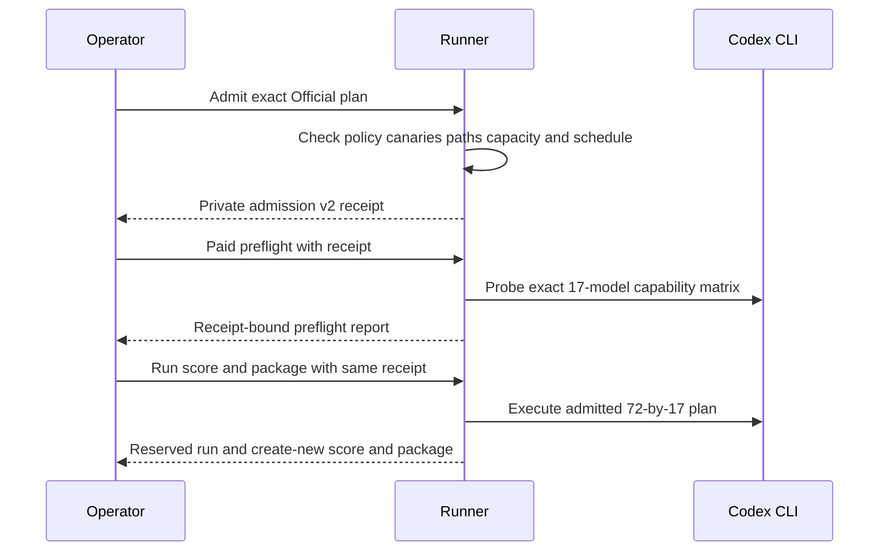
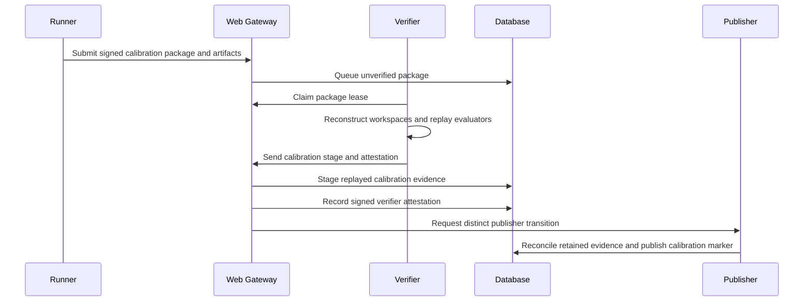
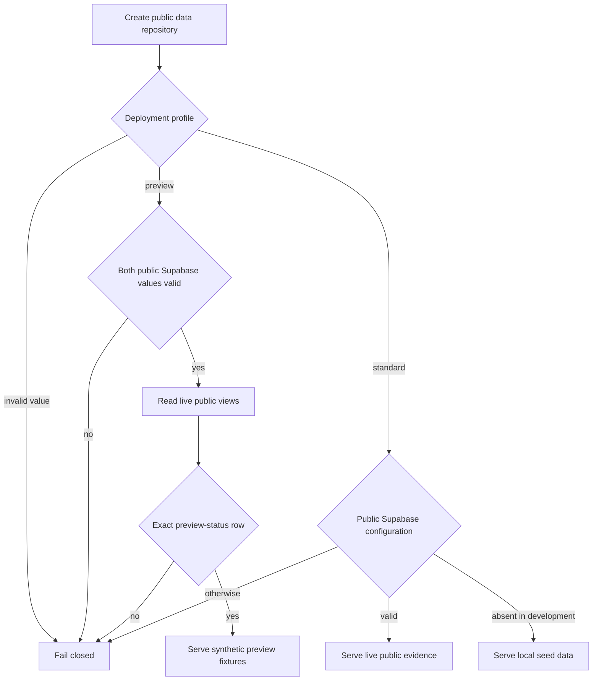

# Architecture and Runtime

## Components

| Component           | Responsibility                                                         |
| ------------------- | ---------------------------------------------------------------------- |
| `apps/aiq-runner`   | Preflight, task execution, scoring, packaging, and submission          |
| `apps/aiq-verifier` | Queue claims, reconstruction, evaluator replay, and attestations       |
| `apps/web`          | Public reads and controlled submission, claim, and verification routes |
| `databases`         | Desired PostgreSQL state, RLS, RPCs, views, and Storage metadata       |
| `benchmarks`        | Public catalog, schemas, and synthetic examples                        |

The operator supplies the private corpus, evaluator files, workspaces, runtime,
Codex profile, and keys. These inputs are not repository data.

## Identity boundary

Production uses three Ed25519 identities:

1. The runner signs `aiq.result-package.v3`.
2. The verifier signs `aiq.verifier-attestation.v3` and must differ from the
   runner.
3. The publisher completes the database publication transition and must differ
   from both.

The gateway mints short-lived custom-role JWTs for verifier and publisher RPCs.
The browser never receives those credentials.

## Bounded Official runtime

`deploy/official-runtime` supplies a local Linux arm64 deployment mechanism with
four non-root, read-only-root containers: runner, runner proxy, verifier, and
verifier proxy. Runner and verifier occupy separate internal networks. The runner
proxy permits only approved Codex hosts plus its canary host; the verifier proxy
permits the production gateway, Supabase, and its canary host while explicitly
denying Codex and OpenAI hosts. Neither side receives a Docker socket or host
port, and all containers drop capabilities and use `no-new-privileges`.

The runtime manager requires a local Docker daemon with Linux `aarch64` and
seccomp, canonical non-overlapping paths, a clean source worktree at the declared
commit, frozen read-only inputs, and exact private ownership on writable roots and
secret files. It recomputes deterministic `aiq.frozen-tree.v1` summaries during
create, validation, and receipt generation. It records secret mount metadata but
never opens or hashes secret contents. Model-free runner and verifier canaries
prove the sandbox and proxy boundaries before the private deployment receipt v2
is issued. [Operations and Validation](operations.md) owns the commands, while
[Deployment Handoff](deployment-handoff.md) treats the receipt as launch evidence.
The bundle does not schedule benchmark commands, invoke Codex during validation,
claim a package automatically, or prove that a production worker is deployed.

## Runner flow

Before any paid Official preflight, `admit-permissions` validates the exact
72-by-17 plan, controlled-input identities, schedule occurrence, conservative
capacity, worker count, managed `aiq_benchmark` policy, sandbox canaries, and the
planned preflight, checkpoint, run, score, and package paths. It writes one
private create-once `aiq.official-permission-admission.v2` receipt without invoking
a model. Paid preflight validates the public catalog, current corpus commitment,
controlled toolchain, evaluator runtime, source manifest, capability manifest,
schedule, and path layout, probes the exact local Codex CLI, and binds its
expiring report to that receipt. The same admission is required by Official
`run`, `score`, and `package`; calibration rejects it.

The flow prevents a model invocation before the exact Official plan passes
permission admission and prevents later stages from silently changing that plan.

A live run uses fresh task workspaces and content-addressed artifacts. It writes
a durable checkpoint and creates one `aiq.run.v3` record. Official run output is
held by an exact run-bound reservation so only the unchanged run may recover it
after interruption; score and package outputs remain create-new. Parent ownership,
nonblocking advisory locks, link checks, and Linux or macOS atomic writes form the
trusted single-writer boundary. An Official run is non-synthetic, complete, and
exactly 17 by 72. Calibration accepts a deterministic subset but remains
untrusted, non-Official, and ineligible for ranking.

After each paid invocation, the runner retains the available invocation and
workspace evidence before cleanup. Authentication, subscription-limit, or
workspace-integrity boundaries cancel remaining paid cells; checkpoints do not
automatically retry indeterminate or boundary-failed cells. This avoids paying
again while replacing evidence whose outcome is uncertain.

`aiq.run-provenance.v2` contains 18 top-level fields. It binds the run class,
corpus, catalog, task set, evaluator, runtime, preflight, harness, prompt, tool
policy, network policy, environment, source manifest, runner executable, Codex
executable, and permission evidence.

## Verification flow

The submission route stores exact package bytes and required artifacts in
private Storage before it queues an unverified inbox record. Queue receipt does
not publish the run.

The verifier claims a bounded lease, downloads only claim-bound artifacts,
reconstructs candidate workspaces, and replays committed evaluators with the
committed runtime. Production requires the `evaluator_replayed` disposition.

The verification route performs three ordered database actions for Official
evidence: stage `aiq.normalized-batch.v3`, record the immutable verifier
attestation, then publish through the distinct publisher role. Calibration uses
the same verifier and publisher identity boundary with separate stage,
attestation, and publication RPCs. Its verifier replays the selected task
artifacts, recomputes descriptive scores and efficiency evidence, and binds them
in `aiq.calibration-verified-stage.v1` plus a signed
`aiq.calibration-verifier-attestation.v1`.

The flow keeps replay-verified calibration evidence public but outside Official
and ranking publication.

Database functions enforce exact structure, identity separation, lease and
attempt bindings, append-only evidence, retained Storage completeness, and the
permanent non-Official classification. Retry-safe recorded dispositions allow a
partially completed multi-RPC request to continue without replacing evidence.

## Database boundary

`databases/schema.sql` owns the complete desired state. Private tables are in
`aiq_private`, with RLS enabled and forced. Security-invoker views and one bounded
trend RPC provide browser reads; calibration adds bounded run, score, result,
and model-efficiency views that require an explicit calibration publication
marker. They expose fixed public-safe failure explanations and omit packages,
signatures, raw provider events, artifacts, and private failure details.

The preview-status view returns one row only when the disposable database has
the required matrix, cardinalities, scoring definition, synthetic boundary, and
empty Official and calibration publication surfaces. It otherwise returns no
private counts. Browser roles do not have private-table write access.

`databases/init.ts` is a one-connection, one-transaction initializer for a new
AIQ database. It inserts the current public catalog, scoring definition, model
matrix, corpus commitment, and runner/verifier/publisher identities.

## Storage boundary

Submitted packages and runner artifacts use separate private buckets. Database
rows bind object type, digest, byte count, retention state, and active
references. Reconciliation records database-only and Storage-only mismatches.
Deletion is a separate bounded worker action and cannot remove referenced or
held objects.

## Public application

The Next.js server reads public views through the configured Supabase API. The
exact `AIQ_DEPLOYMENT_PROFILE=preview` branch requires both browser-safe
Supabase values and reads one bounded status row. That row exists only when the
17-configuration synthetic preview invariants hold and no published or
non-synthetic evidence exists. The Web application then serves checked-in
synthetic fixtures.
Unexpected live evidence fails closed rather than being masked. The preview
remains synthetic under the [Benchmark Method](benchmark-method.md): it adds a
persistent banner, labels complete fixtures as not Official, and emits
`noindex` metadata.

The standard public application also exposes `/calibrations` and
`/calibrations/[id]`. The register uses bounded 20-run keyset pages; detail reads
one selected model's task slice and publishes descriptive score, elapsed-time,
token-coverage, and API-equivalent cost evidence. These pages require explicit
calibration publication and do not feed the Official leaderboard, compare, or
trends surfaces.

Verified Official evidence has a separate public efficiency projection used by
the overview, compare, trends, and Official run-detail pages. Each model row binds
to one published non-synthetic score and its matrix batch. The signed matrix batch
wall-clock is shared by all 17 configurations and counted once; per-cell adapter
durations are summed separately and may overlap at the recorded concurrency. A
narrow per-result view exposes only derived timing, six token categories, cost
status, and verifier-recomputed evidence labels, not raw provider events,
signatures, digests, packages, or private failures. Repository reads reject
duplicate identities, inconsistent shared batch durations, impossible counts,
partial timing groups, invalid coverage percentages, and partial pricing metadata.
The readiness probe includes these public-read contracts under
`public_read_views`. Their measurement meaning belongs to
[Benchmark Method](benchmark-method.md).

The flow shows how standard, local seed, preview, and invalid configurations
select a public-data repository.

The repository selection flow validates the preview database before substituting
explicit synthetic fixtures; [Operations and Validation](operations.md) owns the
commands that initialize and smoke this path.

`GET /api/readiness` checks configuration shape and bounded production
dependencies. It does not claim that a deployment or benchmark run is complete,
and the read-only preview returns `503` because its write and verifier gateways
are intentionally absent.

## Distributed radar

The radar protocol keeps registry identity, signed observations, receipts, and
aggregation evidence distinct. Checked-in radar rows are synthetic. The
repository defines the contracts and public aggregate read but does not operate
a coordinator or remote nodes.
