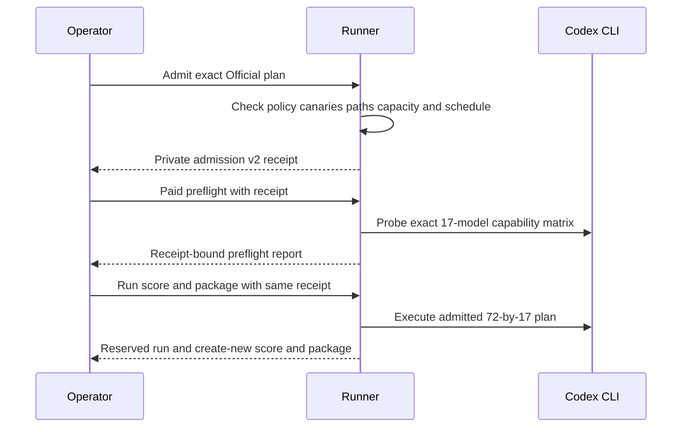
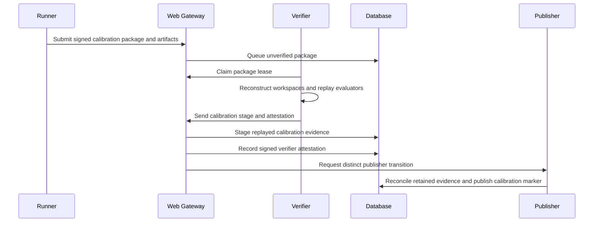
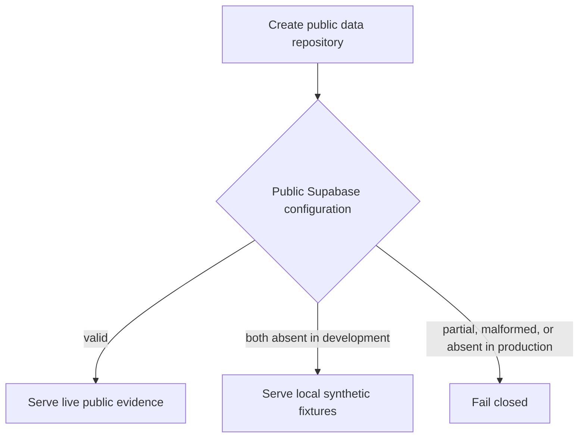

# Architecture and Runtime

## Components

| Component           | Responsibility                                                         |
| ------------------- | ---------------------------------------------------------------------- |
| `apps/aiq-runner`   | Preflight, task execution, scoring, packaging, and submission          |
| `apps/aiq-verifier` | Queue claims, reconstruction, evaluator replay, and attestations       |
| `apps/web`          | Public reads and controlled submission, claim, and verification routes |
| `databases`         | Desired PostgreSQL state, RLS, RPCs, views, and Storage metadata       |
| `benchmarks`        | Public catalog, schemas, and synthetic examples                        |

The operator supplies the private corpus, evaluator files, workspaces, runtime,
Codex profile, and keys. These inputs are not repository data.

Repository source has one active public candidate, task, and scorer contract:
AIQ Core `1.0.6` with task-metadata digest
`sha256:add2a0514b6cdab99b3329d7065565f5606d13af93338e4bc37a0fbd30019b91`,
release-policy identity `aiq-core/1.0.6`, and public release digest
`sha256:5b33cd2daa5efe15e49de34b7137d35bc2ff980a7f619063e7e8b819a857508f`.
This public candidate removes the model wall-clock deadline from all 72 tasks.
Coding-07 retains 32 steps and 21 tool calls; debugging-02 retains 64 steps and
56 tool calls; coding-06, debugging-01, and debugging-04 retain 48 steps and 40
tool calls. The other 67 tasks retain their accepted step and tool-call limits.
Prompt, evaluator, semantic scoring, and tool permissions are unchanged. The
preceding `1.0.5` pilots remain immutable non-Official evidence. The first had
63 completed cells, five timeouts, and saturated completed means. The r11 pilot
stopped on debugging-02 at 47/48 steps and 41/40 tool calls; coding-06 and
debugging-01 had high utilization but no runtime failure. The current task
semantics and calibration implications are
canonicalized in [Benchmark Method](benchmark-method.md).
The public catalog is deterministic and identity-frozen. Independent
no-deadline Core and Contrast A/B seals and both model-free validators produced
the current database task and fixture commitments. One final clean-source seal
is required before calibration. The
shared Rust validator fails closed
unless the runner subtree remains `identity_kind: source_only` with a null
`built_binary_sha256`. The checked Core schema enforces the same rule. Contrast
has equivalent shared typed enforcement even though it has no separate
checked-in JSON schema. Each corpus also binds the Node.js and ripgrep
identities. The source-only corpus rule and signed per-run runner and complete
Codex runtime provenance are the executable product contracts. The
repository-owned `seal-corpus` command creates a complete new Core or Contrast
seal from actual retained assets. It derives source-only runner,
workspace-manifest baseline, controlled-tree fixture and acceptance,
leakage-review, evaluator, runtime, toolchain, and authoring-harness identities.
It is not a task generator and cannot patch a predecessor commitment. One
create-new private directory becomes visible only after production-validator and
baseline round-trip checks pass. After the final
clean build, the operator retains a private, unsigned audit receipt with the
exact source commit and tree identity and SHA-256 values for the native runner,
verifier, Codex executable, and Codex code-mode host. The offline native
verifier validates the receipt against an independently supplied digest. It
does not publish this reproducibility evidence. Node.js and ripgrep identities
remain bound by the corpus. Full calibration, native build
verification, real Official execution, publication, and final deployment of
`1.0.6` are pending. The `1.0.3` Official attempt was interrupted after an
already-conclusive ceiling failure and was rejected as unpublished calibration
evidence. No hidden responses or hidden task details were published. The first
`1.0.4` calibration completed all 1,224 cells but failed the statistical release
gate. It remains non-Official evidence; this does not mean every task execution
failed. The `1.0.6` sequence uses a focused no-deadline canary for the two
previously timed-out Sol ultra cells, followed by the complete 17-by-72
non-Official calibration. Real calibration
can enter the public calibration register only after signed verifier admission
and distinct publication, and it remains non-Official after acceptance.
The accepted production package must be non-synthetic. Its 1,224 task-level
results are one 17-by-72 matrix, not 1,224 separate benchmark runs. The native
verifier must replay the committed evaluators before the distinct publisher can
complete publication. Production exposes only the AIQ Core `1.0.6`, scoring
`1.0.7`, measurement `2.0.0` matrix as `trusted_verified`. No legacy matrix is a
fallback. The outcome and efficiency semantics are detailed in [Benchmark
Method](benchmark-method.md).

## Identity boundary

Production uses three Ed25519 identities:

1. The runner signs `aiq.result-package.v4`.
2. The verifier signs `aiq.verifier-attestation.v4` and must differ from the
   runner.
3. The publisher completes the database publication transition and must differ
   from both.

The gateway mints short-lived custom-role JWTs for verifier and publisher RPCs.
The browser never receives those credentials.

## Native macOS runtime

The current production runtime runs the release builds of `aiq-runner` and
`aiq-verifier` directly on one controlled Apple Silicon macOS host. The runner
receives the private corpus, fresh workspaces, a separate immutable Codex
authentication copy, and only the runner credential needed by the active
command. The verifier receives the committed corpus, evaluator assets,
submitted artifacts, and only its verifier credential. It never receives the
Codex authentication copy.

The runner copies `~/.codex/auth.json` into a mode-private, isolated release
home and injects that directory as the Codex subprocess `CODEX_HOME`. It does
not use the interactive Codex home as its writable execution home.

The native runtime uses canonical non-overlapping paths, a clean source worktree
at the declared commit, exact executable digests, mode-private writable roots,
create-new outputs, and macOS atomic file operations. Before paid preflight and
paid run dispatch, the operator reruns the model-free binding checks. Codex uses
the host's direct network connection. Production does not depend on or run Linux
or Docker. They remain future deployment targets. No cloud runner or verifier
worker and no recurring schedule currently exist.

After model-free validation, the only Official path runs one complete
`72 × 17` matrix of 1,224 observations, replays it with the native verifier,
and publishes the verified batch. [Operations and Validation](operations.md)
owns the native commands, and [Deployment Handoff](deployment-handoff.md) owns
external service configuration and production acceptance.

## Runner flow

Before any paid Official preflight, `admit-permissions` validates the exact
72-by-17 plan, controlled-input identities, schedule occurrence, worker count,
and permission boundary. Capacity evidence records model duration as unbounded
and does not claim that the run fits before another schedule slot. Capacity-admission
v2 represents the model wall-budget sums and model/end-to-end bounds as nullable
when runnable model execution is unbounded; evaluator and orchestration controls
remain bounded. The runner starts Codex with
strict CLI configuration that selects the explicit `aiq_benchmark` profile and
requires external managed requirements to be absent, then runs the sandbox
canaries and validates the planned preflight, checkpoint, run, score, and package
paths. Permission-canary evidence v2 preserves the filesystem read-only and
write-denial checks and network denial. It also executes the committed Node.js
and ripgrep absolute paths directly inside the benchmark boundary. The runner
writes one private create-once
`aiq.official-permission-admission.v2` receipt without invoking a model. Paid
preflight validates the public catalog, current corpus commitment, controlled
toolchain, evaluator runtime, source manifest, capability manifest,
schedule, and path layout, probes the exact local Codex CLI, and binds its
expiring report to that receipt. An available model probe must use a fresh
workspace to execute exactly one command and create the fixed
`AIQ_CAPABILITY_COMMAND_AND_WRITE_V1` marker. The marker is retained as the
content-addressed `capability-marker.txt` artifact; the verifier resolves and
checks its exact bytes before publication. The same admission is required by
Official `run`, `score`, and `package`; calibration rejects it.

The flow prevents a model invocation before the exact Official plan passes
permission admission and prevents later stages from silently changing that plan.

A live run uses fresh task workspaces and content-addressed artifacts. It writes
a durable checkpoint and creates one `aiq.run.v4` record. Official run output is
held by an exact run-bound reservation so only the unchanged run may recover it
after interruption; score and package outputs remain create-new. Parent ownership,
nonblocking advisory locks, link checks, and macOS atomic writes form the
trusted single-writer boundary. An Official run is non-synthetic, complete, and
exactly 17 by 72. Calibration accepts a deterministic subset but remains
untrusted, non-Official, and ineligible for ranking.

The complete Official matrix is one run with 1,224 task-model cells, not 1,224
runs. The admitted plan fixes `--jobs`; scheduling must not start a second run
while the first remains active. Formal task invocations have no wall-clock
deadline. Live step and tool-call budgets still terminate runaway work, and
deterministic evaluator subprocesses remain bounded. A corpus, toolchain, or permission-evidence
digest change defines a different plan. It requires a new admission, preflight,
checkpoint, run, score, package, verifier environment, replay stage, and
attestation; evidence from the changed plan cannot authorize the new one.

After each paid invocation, the runner retains the available invocation and
workspace evidence before cleanup. Authentication, subscription-limit, or
workspace-integrity boundaries cancel remaining paid cells; checkpoints do not
automatically retry indeterminate or boundary-failed cells. This avoids paying
again while replacing evidence whose outcome is uncertain.

`aiq.run-provenance.v3` contains 19 top-level fields. It binds the run class,
corpus, catalog, task set, evaluator, runtime, preflight, harness, prompt, tool
policy, network policy, environment, source manifest, runner executable, Codex
executable, Codex code-mode host, and permission evidence. The selected Codex
executable must live in a private directory containing exactly the `codex` and
`codex-code-mode-host` executable pair. The runner rehashes both files before
and after live dispatch. A successful capability probe also retains an exact
content-addressed marker produced by one real command in a fresh workspace.

## Verification flow

The submission route stores exact package bytes and required artifacts in
private Storage before it queues an unverified inbox record. Queue receipt does
not publish the run.

The verifier claims a bounded lease and downloads only claim-bound artifacts.
It resolves and digest/size-checks every signed capability-probe artifact so
publication retention can prove ownership of that run-level evidence, then
reconstructs submitted workspaces and replays committed evaluators with the
committed runtime. Production requires the `evaluator_replayed` disposition.

The offline `diagnose-rescore` mode is separate from verification and
publication. It verifies the source package signature, provenance, artifacts,
and complete source evaluator replay before it uses the candidate source, tasks,
evaluators, runtime, and toolchain to replay the preserved matrix cells. The
create-new diagnostic is permanently non-Official and non-ranking. It cannot
publish, create a verifier stage, or sign an attestation.

The verification route performs three ordered database actions for Official
evidence: stage `aiq.normalized-batch.v4`, record the immutable verifier
attestation, then publish through the distinct publisher role. Calibration uses
the same verifier and publisher identity boundary with separate stage,
attestation, and publication RPCs. Its verifier replays the selected task
artifacts, recomputes descriptive scores and efficiency evidence, and binds them
in `aiq.calibration-verified-stage.v2` plus a signed
`aiq.calibration-verifier-attestation.v2`.

The flow keeps replay-verified calibration evidence public but outside Official
and ranking publication.

Database functions enforce exact structure, identity separation, lease and
attempt bindings, append-only evidence, retained Storage completeness, and the
permanent non-Official classification. Retry-safe recorded dispositions allow a
partially completed multi-RPC request to continue without replacing evidence.

## Database boundary

`databases/schema.sql` owns the complete desired state. Private tables are in
`aiq_private`, with RLS enabled and forced. Security-invoker views and one bounded
trend RPC provide browser reads; calibration adds bounded run, score, result,
and model-efficiency views that require an explicit calibration publication
marker. They expose fixed public-safe failure explanations and omit packages,
signatures, raw provider events, artifacts, and private failure details.
Browser roles do not have private-table write access.

`databases/init.ts` is a one-connection, one-transaction initializer for a new
AIQ database. There is no migration chain. The pre-release desired state
targets the public AIQ Core `1.0.6` catalog and scoring `1.0.7`.
The controlled production reference must supply a non-synthetic corpus
commitment, a canonical millisecond UTC `published_at`, and the runner,
verifier, and publisher identities. Operationally,
[Deployment Handoff](deployment-handoff.md) requires model-free validation of
the controlled corpus, a verified final native build, and successful native
verifier replay of one real signed non-synthetic 17-by-72 package before
preparing that reference. The operator retains the private final-build audit receipt separately;
the initializer does not consume or validate it. The initializer validates the
reference shape and bindings. It inserts the reference with the model matrix as
the one greenfield desired state.

## Storage boundary

Submitted packages use the private `aiq-submission-packages` bucket. Runner
artifacts use the private `aiq-runner-artifacts` bucket. The greenfield database
schema creates both buckets and enforces their private setting. Database
rows bind object type, digest, byte count, retention state, and active
references. Reconciliation records database-only and Storage-only mismatches.
Deletion is a separate bounded worker action and cannot remove referenced or
held objects.

## Public application

The Next.js server reads public views through the configured Supabase API. The
production path requires both browser-safe Supabase values and serves only live
public evidence. Development uses checked-in synthetic fixtures only when both
values are absent. Partial or malformed configuration fails closed.

The public site is a professional analysis workbench backed by verified
production evidence. Official rows present calibrated ability with its conditional
95% interval. Explicit synthetic fixtures present descriptive quality with
task-mix sensitivity and never appear as Official. Scientific context also
identifies strict pass with its Wilson interval, observation count, coverage,
missing cells, runtime status, scoring method, and provenance. Cost is an
estimated Standard API-equivalent comparison, not an actual ChatGPT or Codex
subscription bill. The public-data repository validates each live public-view
response before rendering:
it requires canonical run and task identities, expected field sets, internally
consistent task counts and status totals, valid timing and token evidence, and
verifier-recomputed cost consistent with the published pricing digest. The
readiness probe verifies the same expanded result-view contract.

The overview leads with the publication identity, three compact benchmark
insights, and the top five configurations. On narrow screens the complete top
five precedes analytical charts in the first viewport. When exact Official
efficiency evidence exists, the primary chart compares calibrated ability with
either summed adapter time or estimated Standard API-equivalent cost. When that
evidence does not exist, the primary chart falls back to the scored
17-configuration matrix. The full matrix still supports dot, bar, and
ordered-horizontal presentations with the interval that matches its primary
metric. If the live
matrix has identities but no scores, the page preserves all 17 identities in an
explicit unavailable-values table instead of displaying zeros or removing the
matrix contract.

Score, run context, and efficiency displays resolve only after an exact run,
configuration, scoring-version, and synthetic/provenance identity join. The
run-detail, compare, and trends routes use the same rule; ambiguous or
mismatched joins remain unavailable rather than borrowing nearby evidence. The
overview fetches the complete run behind the highest point estimate and uses
that run for a task-outcome card, a ten-domain breakdown, and a link to every
task result. Official efficiency reports unavailable and rejected rows
explicitly when its exact evidence cannot be established. Complete matrix,
efficiency, calibration, and provenance tables remain available through
progressive disclosures rather than competing with the first-read results.

These views preserve the scoring and evidence distinctions defined by
[Benchmark Method](benchmark-method.md): calibrated ability is not an IQ estimate,
coverage is not correctness, and API-equivalent cost is not subscription spend.
Semantic outcomes remain separate from runtime, invalid, and missing states.
Charts use ECharts with SVG rendering. The chart wrapper exposes the generated
ECharts description to assistive technology and each chart has a complete data
table. Official charts expose the conditional score interval. Synthetic and raw
quality diagnostics expose task-mix sensitivity. Charts support explicit System,
Light, and Dark themes. Synthetic fixtures remain confined to explicit
development and test paths. Source anchors are
`apps/web/src/app/page.tsx`, `apps/web/src/components/scientific-evidence-resolution.ts`,
`apps/web/src/components/model-matrix-chart.tsx`, and
`apps/web/src/components/run-outcome-card.tsx`.

The homepage composes Results, Trends, Compare, Run archive, Method, and Radar
as one anchored analysis workspace. Primary navigation exposes four direct
anchors: Results, Trends, Compare, and Evidence. Evidence covers the run
archive, method, and distributed-radar sections without a secondary menu. Run
archive pagination stays in the homepage workspace. An exact run keeps a
dedicated `/runs/[id]` deep route and returns to the Evidence anchor. The
implementation anchors are `apps/web/src/app/page.tsx` and
`apps/web/src/components/site-header.tsx`. Browser and static-contract tests
exercise anchored navigation, responsive layouts, theme states, and evidence
discovery across synthetic, invalid, empty, published, and production fixtures.

The standard public application also exposes `/calibrations` and
`/calibrations/[id]`. The register uses bounded 20-run keyset pages; detail reads
one selected model's task slice and publishes descriptive score, elapsed-time,
token-coverage, and API-equivalent cost evidence. These pages require explicit
calibration publication and do not feed the Official leaderboard, compare, or
trends surfaces.

Verified Official evidence has a separate public efficiency projection used by
the overview, compare, trends, and Official run-detail pages. Each model row binds
to one published non-synthetic score and its matrix batch. The signed matrix batch
wall-clock is shared by all 17 configurations and counted once; per-cell adapter
durations are summed separately and may overlap at the recorded concurrency. A
narrow per-result view exposes only derived timing, six token categories, cost
status, and verifier-recomputed evidence labels, not raw provider events,
signatures, digests, packages, or private failures. Repository reads reject
duplicate identities, inconsistent shared batch durations, impossible counts,
partial timing groups, invalid coverage percentages, and partial pricing metadata.
The readiness probe includes these public-read contracts under
`public_read_views`. Their measurement meaning belongs to
[Benchmark Method](benchmark-method.md).

The flow shows how production, local synthetic, and invalid configurations
select a public-data repository.

`GET /api/readiness` checks configuration shape and bounded production
dependencies. It does not claim that a deployment or benchmark run is complete,
and it fails closed when a required production dependency is absent.

## Distributed radar

The `/radar` Runner provenance view presents a retained-record registry and
per-node evidence register: registry status and trust, record recency, latest
capability and observation signature evidence, and provenance. It deliberately
does not use distance, angle, or animation to imply topology or liveness, and no
record is a live heartbeat. The underlying protocol keeps registry identity,
signed observations, receipts, and aggregation evidence distinct. Checked-in
radar rows are synthetic. The repository defines the contracts and public read
but does not operate a coordinator or remote nodes.
